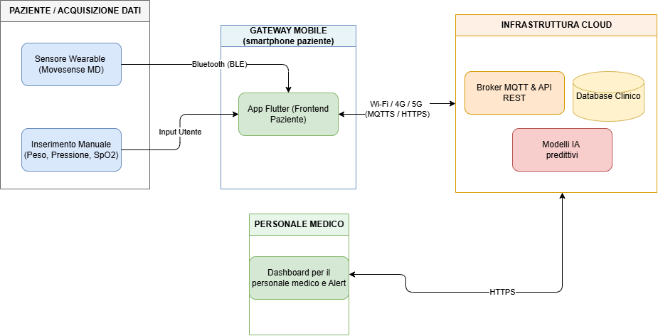

# ❤️ HFTrack - Mobile Frontend Prototype for Heart Failure Monitoring

HFTrack is a **Flutter mobile frontend prototype for patients**, developed as part of a bachelor's thesis on remote monitoring systems for heart failure. It integrates a **Movesense MD sensor** through **Bluetooth Low Energy (BLE)** to acquire and display heart rate and electrocardiogram data in real time.

The application also provides a patient-oriented dashboard for body weight, blood pressure, and oxygen saturation. These three parameters are simulated in the current prototype.

🔗 **Repository:** [UniSalento-IDALab-Bachelor-Thesis/tesi-hftrack-FrancescoFerraro](https://github.com/UniSalento-IDALab-Bachelor-Thesis/tesi-hftrack-FrancescoFerraro)

> **Important:** HFTrack is an academic prototype. It is not a certified medical device and must not be used for diagnosis, treatment decisions, or emergency monitoring.

---

## 🏥 Overall System Architecture

The mobile prototype is designed as one component of a broader conceptual architecture for the remote monitoring of patients with heart failure.



The complete architecture is divided into four main areas:

1. **Patient and data acquisition:** the Movesense MD wearable continuously acquires ECG and heart-rate data, while body weight, blood pressure, and SpO₂ are entered manually by the patient.
2. **Mobile gateway:** the patient's smartphone runs the Flutter application, receives wearable data over BLE, validates manual inputs, manages local state, and acts as the bridge towards remote services.
3. **Cloud infrastructure:** the proposed architecture includes MQTT and REST communication, a clinical database, and predictive AI models for persistence and analysis.
4. **Clinical layer:** a dedicated dashboard would allow healthcare professionals to inspect patient trends and receive alerts.

### Implemented scope

This repository implements **only the patient-side mobile frontend prototype**, represented by the Flutter application inside the mobile gateway.

The following elements belong to the overall proposed architecture but are **not implemented in this repository**:

* cloud backend services;
* MQTT telemetry and remote REST APIs;
* clinical database persistence;
* predictive AI services;
* healthcare-professional dashboard;
* end-to-end patient authentication and remote clinical workflows.

The repository therefore demonstrates local acquisition, presentation, validation, recording, and interaction workflows on the patient's smartphone. It provides a foundation for future integration into the complete telemonitoring architecture.

---

## 📌 Frontend Prototype Overview

The implemented goal is to demonstrate how a Flutter frontend can communicate with a wearable physiological sensor and present heterogeneous health information through a single accessible mobile interface.

Unlike browser-based solutions that access BLE characteristics directly through the Web Bluetooth API, HFTrack uses the **Movesense Device Service (MDS)** and the **Whiteboard resource model**. The smartphone acts as the client: it connects to the sensor and subscribes to resources exposed by the Movesense device.

The main Movesense resources used by the frontend are:

```text
/Meas/HR
/Meas/ECG/256
```

The ECG resource provides data sampled at **256 Hz**. MDS transports the Whiteboard messages over BLE and delivers the received measurements to the Flutter application through the `mdsflutter` plugin.

---

## 🚀 Implemented Features

* 🔍 Discovery of nearby Movesense devices over BLE
* 🔗 Connection and disconnection management
* 🔐 Runtime handling of Android Bluetooth and location permissions
* ❤️ Real-time heart rate visualization in BPM
* 📈 Live ECG visualization at 256 Hz
* ⏱️ Time-scaled scrolling ECG chart
* ⏺️ User-controlled ECG recording
* 📄 Multi-row PDF export of a completed ECG recording
* 👤 Basic user profile data, including age, sex, and height
* ⚖️ Dashboard visualization for body weight
* 🩺 Dashboard visualization for blood pressure
* 🫁 Dashboard visualization for oxygen saturation (SpO₂)
* ⚠️ Basic trend and threshold alerts for the monitored parameters

---

## 🧪 Prototype and Simulated Data

Only the following measurements are acquired from the physical Movesense sensor:

* heart rate;
* ECG samples.

The values used for **body weight**, **blood pressure**, and **SpO₂** are simulated for demonstration purposes. They are defined in the project's `mocks` directory and are not collected from real medical devices or external services.

```text
lib/
└── data/
    └── mocks/
```

The simulated records allow the user interface, charts, data-entry flows, and alert logic to be demonstrated without requiring additional hardware.

---

## 🏗️ Frontend Software Architecture

The frontend project follows an **MVVM-inspired architecture** and uses `Provider` for state management.

```text
Views and widgets
        ↓
ViewModels
        ↓
Movesense / mock data sources
```

The principal responsibilities are divided as follows:

* **Views:** dashboard, cards, charts, forms, and user interactions;
* **ViewModels:** application state, BLE workflow, sensor subscriptions, profile data, health records, and ECG recording state;
* **Models:** representation of health measurements;
* **Mocks:** simulated weight, blood pressure, and SpO₂ records;
* **MDS integration:** communication with Whiteboard resources exposed by the Movesense sensor.

The UI components are additionally organized according to **Atomic Design principles**, separating reusable charts, cards, and input components.

---

## 🛠️ Technologies Used

* **Flutter and Dart** for the mobile application
* **Provider** for state management
* **flutter_blue_plus** for BLE discovery and adapter checks
* **mdsflutter** for communication with Movesense MDS/Whiteboard resources
* **fl_chart** for live charts and health-data visualization
* **permission_handler** for Android runtime permissions
* **pdf** and **printing** for ECG document generation and sharing
* **google_fonts** for UI typography

---

## 🔗 Movesense Communication Flow

HFTrack does not use HTTP to receive sensor measurements. Communication occurs locally over BLE.

```text
Flutter UI
    ↓
Movesense ViewModel
    ↓
mdsflutter plugin
    ↓
Native MDS library
    ↓
Bluetooth Low Energy
    ↓
Movesense Whiteboard resources
```

The application first scans for the sensor and obtains its BLE address. After the MDS connection is established, it subscribes to the required resources:

```dart
Mds.subscribe(
  Mds.createSubscriptionUri(serial, "/Meas/ECG/256"),
  "{}",
  onSuccess,
  onError,
  onNotification,
  onSubscriptionError,
);
```

The Movesense sensor groups acquired samples into messages and sends them to the smartphone through BLE notifications. The application decodes the received event and updates its state and charts.

---

## 📄 ECG Recording and PDF Export

When the sensor is connected, the user can start and stop an ECG recording manually. Recorded samples are kept separately from the short buffer used by the live chart.

After stopping the recording, the application can generate a landscape PDF containing:

* sensor identifier;
* user age and sex;
* sampling frequency;
* start and end time;
* recording duration;
* consecutive ECG strips arranged across multiple rows and pages.

The generated document can be saved or shared through the operating system. Recordings are not stored in a permanent in-app archive.

---

## 📱 Requirements

* Flutter SDK compatible with the project's Dart SDK constraint
* Android Studio or another Flutter-compatible development environment
* A physical Android device with BLE support
* A Movesense MD sensor
* Bluetooth and location services enabled on the Android device
* The native Movesense MDS Android library required by `mdsflutter`

BLE sensor testing should be performed on a physical device rather than an Android emulator.

---

## ⚙️ Android and MDS Setup

The project requires the native Movesense Android library used by `mdsflutter`. If the `.aar` file is not included in the repository, place the required MDS release inside:

```text
android/libs/
```

Ensure that the project-level Gradle configuration includes this directory as a flat-file repository:

```kotlin
allprojects {
    repositories {
        google()
        mavenCentral()
        flatDir {
            dirs("${rootProject.projectDir}/libs")
        }
    }
}
```

The Android manifest must include the permissions required for BLE scanning and connection. On recent Android versions, these include `BLUETOOTH_SCAN` and `BLUETOOTH_CONNECT`; location permission is retained for compatibility with older Android BLE scanning behavior.

---

## ▶️ How to Run

1. Clone the repository:

```bash
git clone https://github.com/UniSalento-IDALab-Bachelor-Thesis/tesi-hftrack-FrancescoFerraro.git
cd tesi-hftrack-FrancescoFerraro
```

2. Install the Flutter dependencies:

```bash
flutter pub get
```

3. Verify that the required MDS `.aar` library and Android Gradle configuration are present.
4. Connect a physical Android device and check the Flutter environment:

```bash
flutter doctor
flutter devices
```

5. Run the application:

```bash
flutter run
```

6. Turn on the Movesense sensor, enable Bluetooth and location on the smartphone, and use the connection control in the ECG card.

To create a release APK:

```bash
flutter build apk --release
```

The generated APK is normally available under:

```text
build/app/outputs/flutter-apk/app-release.apk
```

---

## 🔒 Limitations

* The application is a prototype and is not intended for clinical use.
* Weight, blood pressure, and SpO₂ data are simulated in the `mocks` directory.
* ECG quality depends on correct sensor placement and electrode contact.
* BLE availability and stability can vary between Android devices.
* The project currently targets Android because the native MDS setup is platform-specific.
* ECG recordings are held temporarily in memory and are not maintained in an internal history.
* PDF export is intended for demonstration and is not a certified medical report.

---

## 🎓 Academic Context

HFTrack was developed by **Francesco Ferraro** as a **Bachelor's Degree Thesis project in Computer Engineering** at the University of Salento, during the 2025/2026 academic year.

**Thesis title:**  
*Remote Monitoring Systems for Heart Failure: State of the Art and Development of an Application Prototype*

The work studies remote patient monitoring for heart failure and implements the patient-side mobile frontend of the proposed architecture, focusing on usability, local health-data visualization, BLE acquisition, and Movesense integration.

---

## 👤 Author

**Francesco Ferraro** - *Bachelor's Degree Thesis, University of Salento*
