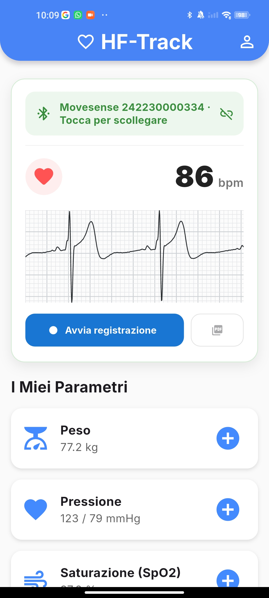
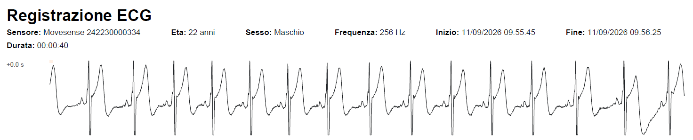
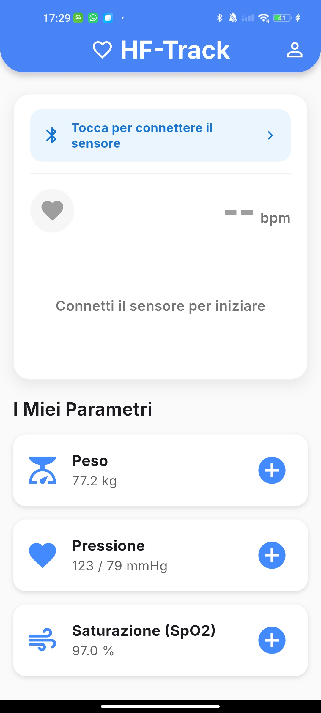

# ❤️ HFTrack

### Mobile Frontend Prototype for Heart Failure Monitoring

HFTrack is a **Flutter mobile frontend prototype for patients**, developed as part of a bachelor's thesis on remote monitoring systems for heart failure. It integrates a **Movesense MD sensor** through **Bluetooth Low Energy (BLE)** to acquire and display heart rate and electrocardiogram data in real time.

The application also provides a patient-oriented dashboard for body weight, blood pressure, and oxygen saturation. These three parameters are simulated in the current prototype.

🔗 **Main repository:** [UniSalento-IDALab-Bachelor-Thesis/tesi-hftrack-FrancescoFerraro](https://github.com/UniSalento-IDALab-Bachelor-Thesis/tesi-hftrack-FrancescoFerraro)

> **Important:** HFTrack is an academic prototype. It is not a certified medical device and must not be used for diagnosis, treatment decisions, or emergency monitoring.

---

## 📱 Application Preview

<p align="center">
  
</p>

The patient dashboard brings the main monitored parameters into a single mobile interface. When a Movesense sensor is connected, HFTrack displays the current **heart rate** together with a **live ECG trace**, while also providing access to body weight, blood pressure, and oxygen saturation data.

---

## 🎥 Demo

A short recording of the prototype is included in this presentation repository:

[**▶️ Watch the HFTrack demo**](docs/hftrack-demo.mp4)


---

## 🚀 Main Features

* 🔍 Discovery of nearby Movesense devices over BLE
* 🔗 Connection and disconnection management
* 🔐 Runtime handling of Android Bluetooth and location permissions
* ❤️ Real-time heart rate visualization in BPM
* 📈 Live ECG visualization at 256 Hz
* ⏱️ Time-scaled scrolling ECG chart
* ⏺️ User-controlled ECG recording
* 📄 Multi-row PDF export of a completed ECG recording
* 👤 Basic user profile data, including age, sex, and height
* ⚖️ Dashboard visualization for body weight
* 🩺 Dashboard visualization for blood pressure
* 🫁 Dashboard visualization for oxygen saturation (SpO₂)
* ⚠️ Basic trend and threshold alerts for the monitored parameters

---

## ❤️ Real-Time ECG Monitoring

HFTrack uses the **Movesense Device Service (MDS)** and the **Whiteboard resource model** to communicate with the wearable sensor. The smartphone acts as the client and receives physiological measurements locally over BLE.

The main Movesense resources used by the frontend are:

```text
/Meas/HR
/Meas/ECG/256
```

The ECG resource provides data sampled at **256 Hz**. Once the sensor is connected, the application presents the current heart rate and continuously updates the ECG chart.

<p align="center">
  
</p>

---

## 📄 ECG Recording and PDF Export

The user can manually start and stop an ECG recording while the sensor is connected. Recorded samples are kept separately from the short buffer used for the live chart.

After stopping the recording, HFTrack can generate a landscape PDF containing the sensor and recording information together with consecutive ECG strips arranged across multiple rows and pages.

<p align="center">
  
</p>

The exported document contains:

* sensor identifier;
* user age and sex;
* sampling frequency;
* start and end time;
* recording duration;
* consecutive ECG strips.

The generated document can be saved or shared through the operating system. Recordings are not stored in a permanent in-app archive.

---

## 📡 Bluetooth and Connection States

The interface reflects the availability and connection state of the Movesense sensor. HFTrack handles BLE discovery, connection and disconnection, Android runtime permissions, and Bluetooth availability.

<p align="center">
  
</p>

When Bluetooth is unavailable, the dashboard communicates the problem directly to the user and prevents sensor-dependent measurements from being displayed.

---

## 📊 Patient Health Dashboard

Only **heart rate** and **ECG samples** are acquired from the physical Movesense sensor.

| Parameter | Source |
|---|---|
| ❤️ Heart rate | Movesense MD sensor |
| 📈 ECG | Movesense MD sensor |
| ⚖️ Body weight | Simulated data |
| 🩺 Blood pressure | Simulated data |
| 🫁 Oxygen saturation (SpO₂) | Simulated data |

The simulated weight, blood pressure, and SpO₂ records allow the user interface, charts, data-entry flows, and alert logic to be demonstrated without requiring additional hardware.

---

## 🏥 Overall System Architecture

The mobile prototype is designed as one component of a broader conceptual architecture for the remote monitoring of patients with heart failure.

<p align="center">
  
</p>

The complete proposed architecture is divided into four main areas:

1. **Patient and data acquisition:** the Movesense MD wearable acquires ECG and heart-rate data, while body weight, blood pressure, and SpO₂ are entered manually by the patient.
2. **Mobile gateway:** the patient's smartphone runs the Flutter application, receives wearable data over BLE, validates manual inputs, manages local state, and acts as the bridge towards remote services.
3. **Cloud infrastructure:** the proposed architecture includes MQTT and REST communication, a clinical database, and predictive AI models for persistence and analysis.
4. **Clinical layer:** a dedicated dashboard would allow healthcare professionals to inspect patient trends and receive alerts.

### Implemented scope

This project implements **only the patient-side mobile frontend prototype**. Cloud backend services, MQTT telemetry, remote REST APIs, clinical database persistence, predictive AI services, the healthcare-professional dashboard, and end-to-end remote clinical workflows belong to the broader proposed architecture and are not implemented in the prototype.

---

## 🏗️ Frontend Software Architecture

The frontend follows an **MVVM-inspired architecture** and uses `Provider` for state management.

```text
Views and widgets
        ↓
ViewModels
        ↓
Movesense / mock data sources
```

The main responsibilities are divided between:

* **Views:** dashboard, cards, charts, forms, and user interactions;
* **ViewModels:** application state, BLE workflow, sensor subscriptions, profile data, health records, and ECG recording state;
* **Models:** representation of health measurements;
* **Mocks:** simulated weight, blood pressure, and SpO₂ records;
* **MDS integration:** communication with Whiteboard resources exposed by the Movesense sensor.

The UI components are additionally organized according to **Atomic Design principles**, separating reusable charts, cards, and input components.

---

## 🛠️ Technologies Used

| Area | Technologies |
|---|---|
| Mobile application | Flutter, Dart |
| State management | Provider |
| BLE discovery | flutter_blue_plus |
| Movesense communication | mdsflutter, MDS / Whiteboard |
| Charts | fl_chart |
| Android permissions | permission_handler |
| ECG document generation | pdf, printing |
| Typography | google_fonts |

---

## 🔗 Movesense Communication Flow

HFTrack does not use HTTP to receive sensor measurements. Communication with the wearable occurs locally over BLE.

```text
Flutter UI
    ↓
Movesense ViewModel
    ↓
mdsflutter plugin
    ↓
Native MDS library
    ↓
Bluetooth Low Energy
    ↓
Movesense Whiteboard resources
```

The application scans for the sensor, obtains its BLE address, establishes the MDS connection, and subscribes to the required measurement resources. Received events are decoded by the application and used to update its state and charts.

---

## 🔒 Prototype Limitations

* HFTrack is an academic prototype and is not intended for clinical use.
* Weight, blood pressure, and SpO₂ data are simulated.
* ECG quality depends on correct sensor placement and electrode contact.
* BLE availability and stability can vary between Android devices.
* The project currently targets Android because the native MDS setup is platform-specific.
* ECG recordings are held temporarily in memory and are not maintained in an internal history.
* PDF export is intended for demonstration and is not a certified medical report.

---

## 🎓 Academic Context

HFTrack was developed by **Francesco Ferraro** as a **Bachelor's Degree Thesis project in Computer Engineering** at the University of Salento, during the 2025/2026 academic year.

**Thesis title:**  
*Remote Monitoring Systems for Heart Failure: State of the Art and Development of an Application Prototype*

The work studies remote patient monitoring for heart failure and implements the patient-side mobile frontend of the proposed architecture, focusing on usability, local health-data visualization, BLE acquisition, and Movesense integration.

---

## 🔗 Complete Project Repository

The complete implementation, setup instructions, and technical documentation are available in the main thesis repository:

[**UniSalento-IDALab-Bachelor-Thesis/tesi-hftrack-FrancescoFerraro**](https://github.com/UniSalento-IDALab-Bachelor-Thesis/tesi-hftrack-FrancescoFerraro)

---

## 👤 Author

**Francesco Ferraro** — *Bachelor's Degree Thesis, University of Salento*
